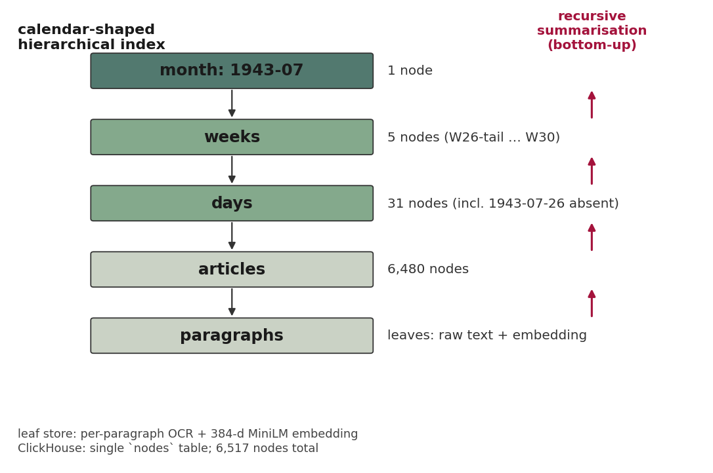
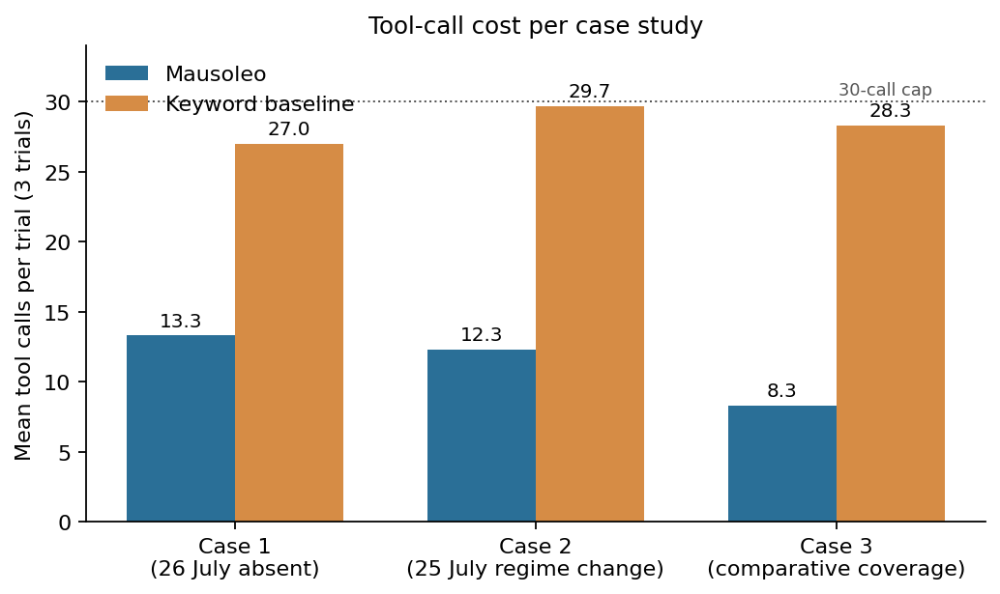

# Mausoleo: reading across a regime change in a digitised newspaper archive

BASC0024 Final Year Dissertation

---

## Abstract

A digitised newspaper corpus normally allows a historian to retrieve articles by keyword, with date as a facet on the side. For the July 1943 *Il Messaggero* corpus this dissertation works with, that template handles questions for which articles exist and breaks down for the others the corpus invites. The morning paper for 26 July 1943 was not printed. The Grand Council had deposed Mussolini overnight and an editorial line could not be drawn in time; a flat article index returns nothing for the date. Questions about the regime-change days of 25 to 27 July return tens of articles that the reader has to assemble by hand. Questions about the war-and-domestic balance across the month return hundreds. The dissertation argues that a digital archive ought to respond to questions of these shapes with the structural information available to it, and builds a system, Mausoleo, that does so by storing the corpus as a calendar-shaped tree of recursively summarised nodes over which a researcher agent navigates through time and structure.

A century of cognitive-science work has accumulated evidence that memory organises temporal information at multiple resolutions. Researchers reading time-stamped material shift between date-bound items and larger schemas built up over weeks. A flat ranked-article interface forces the researcher to perform that integration mentally, holding both the retrieved fragments and the larger temporal shape in working memory at once. Chapter four runs three case studies on whether exposing the temporal structure in the index changes how the work goes. Three questions are put to *Il Messaggero* in July 1943: what the paper said on the absent 26 July, how it covered the regime change of 25 to 27 July, and how the balance of war and domestic-politics coverage moved across the month. Across eighteen scored trials the system averaged 11.3 tool calls against the keyword baseline's 28.3 and was preferred by both judges on a three-dimension rubric in every case. The calendar-shaped index holds a day node for 26 July with empty leaves and a summary that records the absence as evidence, a slot for documented silence that a flat article index cannot provide.

---

## Preface

I came to this project from the engineering side, after a year working on retrieval-augmented generation pipelines for technical documentation. I wanted a final-year project that would put the same techniques in front of source material that does not chunk well, and Italian regime-period newspapers were the natural pick from the languages I read. The 1943 issue list of *Il Messaggero* was the most complete in the available scans, which is how I ended up with a corpus that contained one missing day. Two weeks went into a post-correction pass that made composite OCR scores worse, and another into the realisation that the date-bounded queries the system most needed to answer well were exactly those the keyword baseline was structurally incapable of resolving. Bartlett's *Remembering* was a paper I had read for second-year psychology and went back to once the OCR work began producing day-summary nodes; the hippocampal-mapping work in Eichenbaum and Whittington came in much later, after the calendar-shaped index had already been built.

I thank Dr Yi Gong for supervising. Her comments on the cognitive-science framing, and on what the system can and cannot warrant, shaped the chapters that follow.

---

## Chapter 1: Reading across a regime change

*Il Messaggero* in July 1943 ran daily across thirty issues, covering the war on the eastern and African fronts in parallel with the domestic crisis that culminated in the Grand Council vote on the night of 24 to 25 July, the King's intervention in the afternoon of the 25th, and the formation of the Badoglio government in the days that followed. The dissertation works with the digitised fund of those issues, held in the *Emeroteca digitale* of the Italian *Biblioteca Nazionale Centrale di Roma*. The reading question that motivated the system this dissertation builds was about the editorial-register shift across the deposition: how did the front-page rhetoric of *Il Messaggero* move between the *MinCulPop*-aligned register of mid-July and the new-government register of late-July, and what shape did the war and domestic-politics coverage take across the month around that pivot.

From the digital-archive side, I could not put that question to the existing systems. Article-level keyword search returns lists of articles, not a register-trajectory or a per-week shape. To answer the narrower question about the three days of the deposition I would have had to read thirty articles by hand and compose them into a register comparison; for the wider question about the month I would have had to classify and aggregate several hundred articles from scratch.

One concrete way that hardness shows up is at the date 26 July. A query for *Il Messaggero* on 26 July 1943, addressed to any of the major digitised newspaper archives that hold the paper, returns an empty result page. The 25 July morning edition went to press long before the Grand Council vote that night and in its accustomed late-fascist register. The 27 July edition reappeared under the new government, with the Grand Council *ordine del giorno*, the King's proclamation, and the new ministry on the front page. Mussolini had been deposed and arrested overnight; an editorial line for the morning paper could not be drawn in time and the issue did not run. The 26 July does not appear in the digitised fund because there was no 26 July to digitise. Article-level archives index articles, not days, so a date that has no articles is not surfaced in the catalogue at all.

Since Bartlett's *Remembering* (Bartlett, 1932), cognitive science has documented how recall reconstructs generic schemas rather than verbatim events; his *War of the Ghosts* studies made this pattern visible. Working-memory research subsequently mapped a narrow functional capacity for active processing: Miller proposed roughly seven plus or minus two items (Miller, 1956), though Cowan's later work suggested about four chunks as the realistic ceiling (Cowan, 2001). When an archive question spans a month or longer, this constraint forces compression somewhere in the chain, whether at the interface level or within the reader's cognitive space, and the pressure intensifies as temporal scope widens. This matters directly for how the corpus-based case studies in chapter four operate.

A converging line of research, from Tolman's (1948) spatial cognitive-map experiments to Eichenbaum (2017) on the hippocampal integration of space, time and conceptual relation, suggests that the same neural machinery handles hierarchical structure across these domains. Whittington et al. (2020) modelled the circuit as a general-purpose relational learner. The relevance for an archival interface is direct: the cognitive system already runs multi-resolution hierarchical structure for tasks of an analogous form. When a researcher reads an archive at several resolutions, the interface either holds those resolutions or asks the researcher to hold them. A flat keyword search offloads that holding-work onto the user in ways that slow down recall and increase the risk of losing intermediate findings mid-session.

This dissertation builds and tests an interface that does hold them. Mausoleo stores the *Il Messaggero* July 1943 corpus as a calendar-shaped tree of recursively summarised nodes, with the leaf level holding paragraphs of source text and successively higher levels collecting articles into days, days into weeks and weeks into a single month root. The schema permits days with no underlying articles. Higher up the tree, the week-of-25-July node carries an integrated summary of the regime-change trajectory, and at month level the index records the schematic monthly shape against which the per-week war and domestic balance can be read. A researcher agent navigates the tree and may also issue keyword and embedding searches over the same corpus. Three case studies on the July 1943 material, evaluated against a keyword baseline over identical article transcriptions, ask whether the multi-resolution interface improves on the flat one across the question types above.

A recent NLP literature on hierarchical retrieval, surveyed in chapter two, derives its hierarchy from the corpus itself, either by clustering text chunks (Sarthi et al., 2024) or by community detection on an entity graph extracted from the documents (Edge et al., 2024); a related line works from the document's surface section structure (Zhang and Tang, 2025). Mausoleo borrows its hierarchy from the publication calendar that the printers already followed. The pay-off shows up most clearly on the absent-day case, since the calendar contains a slot for 26 July whether or not anything was printed on it, while a clustering-induced hierarchy has nothing to cluster from when the data are absent and thus cannot preserve the structural significance of what did not appear.


---

## Chapter 2: Two literatures and a corpus

The dominant access mode in the long line of digital newspaper archives remains the keyword query against an OCR'd full text. A more recent strand in information-retrieval research has been doing hierarchical access, with the hierarchies usually induced from the corpus itself by clustering or graph-community methods. A much older body of cognitive-science work on how memory organises temporal material at multiple resolutions has not been much operationalised for archival interface design, and the corpus carries its own source-critical context that the case studies in chapter four read with.

### Existing digitised newspaper archives

Two systems set the comparison points. *Europeana Newspapers* aggregates around 28 million pages across forty European languages through full-text search backed by OCR of variable quality and limited named-entity enrichment, the largest pan-European digitised newspaper aggregator and the natural baseline for any new venture working at the European scale. *Impresso*, the Swiss and Luxembourgish project, sits at the enriched end of the spectrum: alongside OCR it offers named-entity recognition, topic models, lexical-semantic comparison and text-reuse browsing across roughly two centuries of French, German and Luxembourgish newspapers (Ehrmann et al., 2020; Düring et al., 2024). The US comparator *Chronicling America* (the National Digital Newspaper Program at the Library of Congress, around 23 million pages from 1690 to 1963) is omitted from the head-to-head because the case studies in this dissertation are Italian-language. It remains the third major reference point in the field at scale.

What unites these systems is the access template. The user arrives with a query, receives a ranked article list, optionally facets the result by date, year or source, and then reads articles individually. Düring et al. (2024) describe the Impresso interface as one of "transparent generosity" about exposing intermediate structure; the user is still expected to come with a search term already in mind. The presupposition is reasonable for most historical research, where the historian arrives with a question already framed. It is less reasonable for the historian who wants to understand a corpus they cannot read in full at the article level. It is less reasonable, too, for one whose answer is not a list of articles, where the answer is a shape that moves across days, or an absence that might matter more than what was printed.

### The hierarchical-retrieval lineage

Classical information retrieval supplies the baseline. Salton, Wong and Yang (1975) introduced the vector space model; Robertson and Zaragoza (2009) consolidated the probabilistic-relevance tradition that culminated in BM25, still the strongest sparse baseline. Both treat the document collection as a flat set: relevance is computed per document and the structure of the collection plays no role in retrieval.

The recent hierarchical-retrieval lineage breaks with this assumption. RAPTOR (Sarthi et al., 2024) builds a retrieval tree by recursively clustering chunk embeddings and summarising each cluster, allowing the same query to hit a leaf passage or a higher-level summary depending on its scope. GraphRAG (Edge et al., 2024) takes a different route: it extracts an entity-relation graph from the corpus, runs Leiden community detection over the graph, and writes summaries at each community level. The Edge et al. paper reports substantial gains over flat retrieval-augmented generation for global-summarisation queries on three benchmarks. The entity-extraction pass and the community summarisation are both expensive at scale, and the resulting hierarchy is opaque to the user since a researcher cannot tell from the surface why two summaries sit at the same level. A related line uses the document's own table-of-contents as the retrieval target (Zhang and Tang, 2025), and reads its hierarchy off the surface. The hierarchies these systems propose emerge from the data or rest on a document's structure; in either case the retriever has more to work with than a flat list, and the induced or surface-level stratification can guide what scope of answer a query demands.

Murugaraj et al. (2025) is the closest prior work on retrieval-augmented generation over historical newspapers; they apply a topic-restricted retrieval pipeline to the Impresso Swiss corpus and report improved retrieval relevance over flat retrieval-augmented generation, measured by BERTScore, ROUGE and UniEval. Their pipeline restricts retrieval to documents matching the query's inferred topic, on the assumption that topical coherence between query and retrieved articles is the dominant signal of relevance. For a question about a regime collapse, the topically most-relevant articles cluster around the surface vocabulary of fascism (Mussolini, Grand Council, Badoglio); returned at a uniform editorial register they flatten the very shift the question asks about. The metrics in their evaluation reward semantic overlap between answer and reference and do not measure whether the answer captures a temporal trajectory. A topic-restricted pipeline answers what topically-relevant material the corpus contains. I am asking a different sort of question: what a particular temporal slice looked like, with its absences and ruptures intact. A direct head-to-head on Impresso is the obvious experiment. It is gated on language, since the Impresso corpus is French and German, and the case-study agent and judges in chapter four are configured for Italian.

Mausoleo changes the source of the hierarchy again. Daily newspapers carry a temporal hierarchy in their production schedule: paragraph in article in issue in day in week in month. The index inherits that structure directly. The navigation surface stays predictable to a working historian without depending on extraction quality or a clustering choice that external data might disrupt.

### Memory, hierarchy and external structure

Why the calendar-given hierarchy should be the right shape of index for an archival interface, beyond one designer's preference, is the substantive cognitive-science claim the dissertation rests on. Several converging strands from cognitive science support it, and they are worth taking in turn.

Bartlett (1932) introduced the term *schema* for the compressed, generic templates that organise specific recollections, and showed in his *War of the Ghosts* studies that what survives recall over time is the schema and not the verbatim event. Craik and Lockhart (1972) reframed retention as a function of depth of processing, with deeper semantic encoding producing more durable traces. The contemporary picture distinguishes episodic memory, events bound to time and place, from semantic memory, compressed general knowledge, and from the schema-level abstractions Bartlett described, with episodic traces consolidating over time into semantic and schematic structures. The relevance to an archival interface is direct. A corpus carries material from individual articles up through narrative arcs and aggregate patterns at the month or longer scale, and a researcher reading the corpus moves between those levels.

Miller's (1956) *magical number seven plus or minus two* and Cowan's (2001) revised estimate of about four functional chunks both put the active workspace at a small handful of items. For an external retrieval system, compression at multiple resolutions becomes the precondition for the corpus being cognitively tractable at all. Thirty article snippets are more than the active workspace can comfortably hold, and a single day summary at an appropriate level of abstraction is much closer to that limit.

Tolman (1948) showed that rats build *cognitive maps* exceeding stimulus-response chains. Eichenbaum (2017) consolidated the view that the hippocampus encodes spatial position alongside temporal and conceptual relation in a shared representational format. Behrens et al. (2018) reviewed the evidence that the spatial-coding machinery is recruited for non-spatial structural inference, and Whittington et al. (2020), in the Tolman-Eichenbaum-Machine, modelled the same circuit as a general-purpose relational learner factorising structure from content. A temporal index that runs at multiple resolutions therefore works in the same structural form the brain uses for analogous spatial and conceptual problems.

The case studies in chapter four ask whether the prediction implied by these three strands of cognitive science shows up in the metrics.


If the cognitive framing motivates the design, the corpus context decides whether the case studies mean anything historically. *Il Messaggero* in July 1943 was a regime-aligned daily under the directives of the *MinCulPop*. Schudson (1978) treats the social construction of news as itself a historical process; Murialdi (1986) remains the standard treatment of the Italian press across the regime period, documenting the directive system that shaped what could and could not appear in print. Without this context, the case-study questions in chapter four would not land as the questions a working historian would actually put to this material. Any summary the index produces functions as a derived secondary source, and its relation to the regime-aligned primary text needs to be open to inspection. The schema's separation of leaf text from summary text keeps the original paragraphs reachable from every higher-level node. ISAD(G) names this archival principle *respect des fonds* (International Council on Archives, 2000).

---

## Chapter 3: How Mausoleo is built

Three loosely coupled stages of Mausoleo connect through a single ClickHouse table called `nodes`. An OCR pipeline produces hand-cleanable article-level transcriptions from page scans; a recursive summariser builds the calendar-shaped tree over those transcriptions; and a small JSON-emitting command-line interface lets a researcher agent read the tree. The boundary between stages is the schema of the table, so each stage can be swapped or replayed without touching the others.

### From scanned pages to article transcriptions

The OCR stage receives scanned JPEGs as input, with six pages per issue on average across the thirty surviving July 1943 issues of *Il Messaggero*. Output takes the form of per-issue JSON files that list detected articles, including headline, body text and page span. The pipeline operates only in cold-cache run mode, where every prediction regenerates from raw images on each invocation within a budget of thirty minutes wall-clock per issue on two GPUs.

Eight sub-pipelines execute in parallel across the two GPUs, with their predictions merged deterministically. The diversity across pipelines is intentional: three model configurations (an open-weight vision-language model in two backbone versions, the second under a strict generation mode) load on each GPU, and the eight sub-pipelines vary column-split granularity (full-page, two- through six-column splits, plus a small-region detector running over layout boxes) so that no single layout assumption dominates. Trained for dense document understanding (Bai et al., 2025), the Qwen2.5-VL backbone functions as a black-box OCR engine prompted to emit structured article JSON. The eight per-source predictions merge through a deterministic chain consisting of a REPLACE pass, an ADDITIVE pass for the column-six advertisements source, and a quality-weighted text selector, without any LLM arbitration or post-correction. Both LLM arbitration and prompt-based post-correction were tested during the hill-climb and rejected: the post-corrector modernises good articles into paraphrases more than it repairs bad ones, costing 0.6 to 1.1 composite points across three serious attempts.

Two empirical observations guided the design. Predictions from a single model exhibit high correlation across column splits, which means that a fifth column-three pipeline drawn from the same family contributes less than a different model family at the same column count; cross-family diversity yields a roughly 0.013 composite gain over the best single-family ensemble at equal wall-clock budget. The wall-clock ceiling also matters: an unconstrained research configuration reaches 0.92 composite at fifty to sixty minutes per issue, which exceeds what a one-month corpus build at 30.5 minutes per issue can sustain.

The cold-cache composite was evaluated on two hand-cleaned issues (1885-06-15, 41 articles; 1910-06-15, 193 articles) using an article-level matching scheme, yielding 0.90 averaged across the two issues, decomposing to 0.872 on 1885 and 0.926 on 1910. The composite metric weights character error rate, article-level recall, ordering, headline character error rate and page-accuracy; the exact weight breakdown appears in Appendix A. Article-level matching was preferred to flat full-text character error rate because the latter penalises any displacement of an article in reading order even when its text is character-perfect; this convention follows historical-newspaper OCR work in NewsEye (Doucet et al., 2020). The single biggest gain throughout the hill-climb came from a post-processing filter that strips raw-JSON regurgitations occasionally leaking from the vision-language sources, contributing roughly 0.016. A leave-one-out at the five-source intermediate stage confirms no entry is redundant. Per-pipeline component scores and configuration tables are in Appendix A.

{ width=65% }

Of the 9,456 raw articles emitted by the ensemble, the 6,480 article-level transcriptions used downstream derive from a hand-cleaned post-pass that performs deduplication and cross-page stitching; this post-pass falls outside the OCR composite score.

### The calendar-shaped tree

All index storage resides in a single table in ClickHouse. Each row represents a level of a node, with the leaf level being paragraphs, followed by articles, days, weeks, and months. The full schema also includes levels for years and decades above months and an archive root above decades. Each row stores a parent identifier, a sibling position, a date range, a summary, an embedding vector, and raw OCR text for leaf paragraphs only. Higher levels contain no raw text but instead contain summaries and pointers downward. I follow Ketelaar (2001) on archival description as a tacit narrative: summaries are treated as derived and authority rests at the leaf level paragraphs.

Human-readable deterministic identifiers distinguish nodes: `1943-07-25_a127_p03` for a paragraph, `1943-07-25_a127` for an article, `1943-07-25` for a day, `1943-W29` for a week, `1943-07` for a month. The table carries two secondary indexes: a vector-similarity index over the embedding column for nearest-neighbour search, and a token-bloom-filter index over the summary column for keyword search.

Construction proceeds bottom-up, one level at a time. A batch process generates article summaries from each article's paragraphs, and the same recursive approach produces summaries at coarser grain for days, weeks, and months. This lineage derives from the recursive book summarisation of Wu et al. (2021), which shows that bottom-up summarisation at a fixed branching factor yields coherent abstractions without exceeding any context window. The summariser prompt remains consistent across levels: target two to four hundred words, integrate named entities into the prose without listing them, preserve dates and quantities verbatim, and write so that an agent can decide from the summary alone whether to descend further. Length is deliberately held constant, which makes navigation predictable at the cost of aggressive thematic compression at higher levels. A spot-check against ten July 1943 day summaries (excluding the absent 26 July) recovered forty-eight of fifty top named entities through accent-stripped substring match against the day's hand-cleaned transcription; the two misses were both `Papa Pio XII`, where the summariser inserted an editorial honorific the press itself never used, preferring `Pio XII` or `il Pontefice`. An information-loss trace on 1943-07-03 establishes the compression rate precisely: of thirty-six distinct named entities in the day's three longest articles, seven survive at day level, six at week, one (`Il Messaggero` itself) at month. Generic organisational acronyms tend to drop out at the week boundary. Named individuals perform better, persisting through week-level summaries before being absorbed into the month abstraction. Place names sit between the two categories, holding at day and mostly absent by month. This has implications for navigation: the month level supports questions about what kind of day it was. The month level does not support questions about who appeared in it.

For July 1943, 6,480 article nodes aggregate into 31 day nodes, 5 weeks, and 1 month root (6,517 nodes in total). Cardinality varies from day to day; the schema permits this through empty days, and the table contains a row for each calendar position regardless of whether its leaf paragraphs are populated. The week-of-25-July summary closes with a prolepsis added by the summariser (*Sconosciuto ai lettori del Messaggero: il giorno successivo, 25 luglio, avverrà l'arresto di Mussolini*), supplying historical context the source could not have contained; chapter four returns to this as a summariser-bias phenomenon. At month level the prolepsis collapses into *l'arresto di Mussolini (25 luglio)*, with the 02:40 timestamp and the Grand Council mechanism compressed away.

{ width=65% }

### How the agent reads the tree

A small server backed by ClickHouse and a typer-based command-line interface exposes retrieval, with a researcher agent as the user and every command emitting structured JSON to standard output. Tree traversal is exposed through `GET /root`, `/nodes/{id}`, `/nodes/{id}/children`, `/nodes/{id}/parent` and `/nodes/{id}/text` (raw text for leaves, reconstructed from descendants for higher nodes). Search capabilities include `POST /search/semantic` (vector approximate-nearest-neighbour over the vector-similarity index, filterable by level or date range), `/search/text` (token-bloom over summary text) and `/search/hybrid` (a weighted combination). A `GET /stats` endpoint reports per-level node counts.

Following the ReAct loop pattern of Yao et al. (2022), the agent departs from single-shot retrieval-augmented generation (Lewis et al., 2020) by starting at the root, reading a summary, deciding whether to descend or to search, and iterating. Chronological position is carried by tree traversal; semantic search becomes the fallback when the question is not naturally chronological. The application programming interface is small and stateless, leaving reasoning to the agent.

---

## Chapter 4: The missing 26 July, and two contrast cases

The comparison in all three cases is to a BM25 baseline over the same hand-cleaned article transcriptions in the `documents` table, with no access to the `nodes` hierarchy. Mausoleo runs the agent-mediated tree traversal of the previous chapter, with `documents` plus `nodes` plus the semantic, text and hybrid search endpoints. The researcher agent is held constant across both arms (a contemporary commercial LLM under identical system prompt), with a tool-call cap of thirty per trial and three trials per cell at distinct seed prompts. Three metrics are applied uniformly across cases: tool calls and characters returned to the agent's context for efficiency; recall against a hand-built relevance ground truth on the first two cases (single-annotator, against four works of historiography: Pavone, 1991; Murialdi, 1986; Bosworth, 2005; Deakin, 1962) and ratio mean absolute error and root-mean-square error against a per-week war/domestic oracle on the third for completeness; and the mean of two LLM judges scoring at zero to five on each of the three rubric dimensions described in the supplementary material for quality.

### The missing 26 July

What did *Il Messaggero* report on 26 July 1943, the day after the deposition of Mussolini? The most consequential fact in the digitised corpus is that the issue is not there. A date-bounded query against the article-level corpus returns the empty set. For an episodic-retrieval task this is the case the design was built around. In Mausoleo the day node `1943-07-26` exists in the table whether or not its leaves contain text, with a summary attached that contextualises the gap; the agent reads the summary directly. Episodic memory works the same way at the cognitive level: events whose temporal slot the memory system does not hold cannot be flagged as missing, only as failures of recall.

The baseline cannot surface the absence as a node. A keyword query for a date with zero hits returns nothing the agent can interpret directly; the researcher agent issues 27.0 tool calls on average across the three trials, reading the 25 and 27 July issues that bracket the gap and inferring backwards. The compiled answer scores recall of 0.67 against the 42-article relevance set, with a judge-mean quality of 4.22. In two of three trials the baseline agent infers the absence without ever issuing a query for 26 July material, reasoning around the data deficit from its training-corpus knowledge of the regime change. The keyword baseline treats a question that has an answer as though it had none, and the agent then supplies one from outside the source.

Mausoleo can ground the question. The day node `1943-07-26` exists in the `nodes` table even though its leaf paragraphs are empty, and its summary, generated at index-build time, is the answer to the question:

> [edizione assente: il fondo archivistico digitalizzato non contiene il numero del 26 luglio 1943 de «Il Messaggero». Il giorno precedente, notte fra 24 e 25 luglio, il Gran Consiglio del Fascismo aveva votato l'ordine del giorno Grandi alle 02:40, e nel pomeriggio del 25 Vittorio Emanuele III aveva fatto arrestare Mussolini all'uscita da Villa Savoia. Il giornale del 27 luglio riapparirà sotto il nuovo governo Badoglio. La lacuna archivistica del 26 luglio è essa stessa documento: testimonia il vuoto editoriale di quelle 24 ore di transizione di regime.]

The Mausoleo agent reaches this node in roughly thirteen tool calls on average, and its compiled answers score a judge mean of 4.56 against the baseline's 4.22. Recall against the article-id ground truth is 0.67, tied at the mean with the baseline; per-trial dispersion is diagnosed in the variance note in the supplementary material. Article-touching cannot score a question whose answer is an issue that does not exist, so the recall tie does not separate the systems on this case.

Because date is a structural property of the index (a slot at the day level, populated whether or not the corresponding issue exists) even a date that has no articles still has a node, and that node can carry a summary that the agent can read directly; a flat retriever has no equivalent slot for the missing day. Recovering the same behaviour from outside would mean adding side-channel metadata: a separately maintained list of known-missing issues, or extra instructions in the agent prompt about checking for absences before giving up. The calendar-shaped hierarchy makes both workarounds unnecessary, since the gap is already inside the index.

The failure here sits at the data model itself, which holds only article-shaped slots and no slots for dates as such; an empty article-list response is a symptom of that, not a search-engine bug to be patched. Romans reading the paper that morning learned of the deposition before the morning paper would normally have arrived, and registered that no paper had arrived; that registration was part of the experience of the day, in the way Pavone (1991) treats the *interregno* between deposition and 8 September as a historical category in its own right and not a mere gap in the record. The indexing architecture has to refuse the move that reads a non-existent issue as a null query result. In Mausoleo's three trials the agent reaches `1943-07-26`, reads the summary, and incorporates the absence as evidence into its compiled answer. In two of the baseline's three trials the agent never asks the index whether the 26 July edition exists at all, falling back on its own training-corpus knowledge of the regime change. The two compiled answers therefore differ in a way the touched-set recall metric does not capture: in Mausoleo's case the answer is grounded in the index, in the baseline's it leans on the agent's training-corpus knowledge of the regime change.

Reading the actual 27 July reappearance issue alongside the day node sharpens what the gap holds. The 27 July paper opens with the King's proclamation in centre-page and the Badoglio government list to the right; the *Grandi ordine del giorno* is reproduced verbatim further down the front page; the editorials drop the *MinCulPop*-aligned register that had still been audible in the 25 July morning paper without commenting on the change. The summary node for 26 July does not contain any of that, of course (it cannot, because the issue does not exist). Reading the 27 July issue against the 26 July summary makes legible what the 26 July issue would have had to do had it appeared. No editorial line on the deposition was available in time, and an issue without one would have had no plausible front page. The summariser has no way of choosing among these counterfactuals. The index makes it possible for the researcher to ask the counterfactual at all by holding a slot for the missing day in which to ask it.

### Two shorter cases

The 25-to-27 July regime-change reconstruction cleared in 12.3 Mausoleo tool calls against a baseline that saturated its thirty-call budget on every trial, posting recall of 0.76 versus 0.62 and quality scores of 4.83 versus 4.44, κ = 0.57. One detail in the agent log is worth flagging: in the second of three Mausoleo trials the agent reached the week-of-25-July node only after first descending through four day nodes, retracing prose it had already read at the day level, which counts as four wasted tool calls on the budget; the cell-mean tool-call figure conceals this without the trace. The day-summary nodes already carry editorial tone, so the agent reads it directly off the prose without needing further abstraction. The per-week war-versus-domestic-balance question presented a different challenge: it is an aggregate question where touched-set recall becomes the wrong instrument, a first run having yielded a misleading 0.07 versus 0.11. The task was rerun against an oracle built by classifying all 6,480 articles into WAR / DOMESTIC / OTHER categories and then reducing to a per-week war fraction (W26 0.558, W27 0.589, W28 0.620, W29 0.733, W30 0.416). On this corrected oracle, Mausoleo wins on ratio MAE (0.149 vs 0.194), on tool calls (8.3 vs 28.3), and on quality metrics (4.06 vs 3.17), which marks the largest quality gap across all three cases, with κ = 0.14.

### Aggregate numbers

All eighteen planned trials completed. Per-cell means are below.

| Case | Metric | Mausoleo | Baseline |
|---|---|---|---|
| 26 July absent | Tool calls | 13.3 | 27.0 |
| 26 July absent | Recall vs GT | 0.67 | 0.67 |
| 26 July absent | Quality (judge mean) | 4.56 | 4.22 |
| 25 July regime change | Tool calls | 12.3 | 29.7 |
| 25 July regime change | Recall vs GT | 0.76 | 0.62 |
| 25 July regime change | Quality (judge mean) | 4.83 | 4.44 |
| Comparative coverage | Tool calls | 8.3 | 28.3 |
| Comparative coverage | Ratio MAE | 0.149 | 0.194 |
| Comparative coverage | Ratio RMSE | 0.166 | 0.220 |
| Comparative coverage | Quality (judge mean) | 4.06 | 3.17 |

The regime-change case cleared in roughly twelve Mausoleo tool calls against a baseline that saturated its thirty-call budget every trial. On the missing-day case the tool-call cost was halved while touched-set recall tied, an artefact of the metric not being able to score an issue that does not exist. The comparative-coverage case showed the largest quality gap and the lowest κ, the latter reflecting how poorly the narrative-completeness rubric fitted an aggregate-shape answer.

{ width=65% }

{ width=65% }

---

## Chapter 5: Discussion

Of the three case studies, the regime-change case is the one whose result is most straightforward: the calendar-shaped index does the work the baseline has to do article by article, and the cost gap is what would be expected from compression at the day-summary level. The comparative-coverage case is harder to read: the largest quality gap of the three sits there. The κ between judges is also the lowest. That low κ is partly an artefact of the rubric (a narrative-completeness rubric does not fit an aggregate-shape answer well, and the spread between the two judges' scores tracks that misfit more than it tracks disagreement about the underlying answer). The missing-day case is the case the design was built around, and the recall tie at 0.67 deserves a sentence of its own: the baseline arrived at the absence through a route the metric cannot tell apart from Mausoleo's, by reading the 25th and 27th issues and reasoning around the gap from training-corpus knowledge of the regime change. A touched-set recall metric cannot distinguish a grounded answer from a backfilled one.

I read the results as consistent with the cognitive-science framing chapter two laid out, with the qualification that consistency at this scale is weak evidence: working-memory limits (Miller, 1956; Cowan, 2001) predict a cost gap of the right sign and the data show one. I do not have the power in this experiment to discriminate that explanation from a generic compression-helps-retrieval one. The hippocampal-mapping work (Eichenbaum, 2017; Whittington et al., 2020) sits at a further remove: the multi-resolution form runs in the same domain-general machinery that handles analogous spatial and conceptual problems. Whether an LLM agent accesses any of that through the same route that biological learners do is a question I cannot put to the cases as run.

The summariser adds material the underlying issues did not contain. The week-of-25-July *prolepsis* on Mussolini's not-yet-announced arrest is the clearest instance, and it raises a second-order question for any future evaluation in the lineage of Murialdi (1986): how much of the measured gain comes from the index's compression of the source, and how much from elaborations the summariser inserted that read as historiographically warranted while having no equivalent in the source. I report forty-eight of fifty named entities recovered in the chapter-three spot-check, a low-precision instrument for that question; a higher-precision instrument would compare the summary against a hand-written reference summary by a working historian.

What I have not shown: whether the cost gaps generalise outside July 1943, whether they hold for question types I have not yet tested (a single-event close-reading without temporal-aggregation structure, or a long-arc comparative across years), and whether a researcher who is not an LLM agent shows the same pattern. None of these are within the dissertation's scope and none of them can be inferred from the cases as run.

---

## References

Bai, S., Chen, K., Liu, X., Wang, J., Ge, W., Song, S., Dang, K., et al. (2025) 'Qwen2.5-VL Technical Report', *arXiv preprint* arXiv:2502.13923.

Bartlett, F.C. (1932) *Remembering: A Study in Experimental and Social Psychology*. Cambridge: Cambridge University Press.

Behrens, T.E.J., Muller, T.H., Whittington, J.C.R., Mark, S., Baram, A.B., Stachenfeld, K.L. and Kurth-Nelson, Z. (2018) 'What is a cognitive map? Organizing knowledge for flexible behavior', *Neuron*, 100(2), pp. 490–509.

Bosworth, R.J.B. (2005) *Mussolini's Italy: Life under the Dictatorship, 1915–1945*. London: Allen Lane.

Cowan, N. (2001) 'The magical number 4 in short-term memory: a reconsideration of mental storage capacity', *Behavioral and Brain Sciences*, 24(1), pp. 87–114.

Craik, F.I.M. and Lockhart, R.S. (1972) 'Levels of processing: a framework for memory research', *Journal of Verbal Learning and Verbal Behavior*, 11(6), pp. 671–684.

Deakin, F.W. (1962) *The Brutal Friendship: Mussolini, Hitler and the Fall of Italian Fascism*. London: Weidenfeld and Nicolson.

Doucet, A., Gabay, S., Granroth-Wilding, M., Hulden, M., Düring, M., Pfanzelter, E., Marjanen, J., et al. (2020) 'NewsEye: a digital investigator for historical newspapers', in *Proceedings of Digital Humanities 2020*. Ottawa: ADHO.

Düring, M., Bunout, E. and Guido, D. (2024) 'Transparent generosity: introducing the impresso interface for the exploration of semantically enriched historical newspapers', *Historical Methods: A Journal of Quantitative and Interdisciplinary History*, 57(3), pp. 1–20. doi:10.1080/01615440.2024.2344004.

Edge, D., Trinh, H., Cheng, N., Bradley, J., Chao, A., Mody, A., Truitt, S., Metropolitansky, D., Ness, R.O. and Larson, J. (2024) 'From local to global: a Graph RAG approach to query-focused summarization', *arXiv preprint* arXiv:2404.16130.

Ehrmann, M., Romanello, M., Clematide, S., Ströbel, P.B. and Barman, R. (2020) 'Language resources for historical newspapers: the impresso collection', in *Proceedings of the 12th Language Resources and Evaluation Conference*. Marseille: ELRA, pp. 958–968.

Eichenbaum, H. (2017) 'On the integration of space, time, and memory', *Neuron*, 95(5), pp. 1007–1018.

International Council on Archives (2000) *ISAD(G): General International Standard Archival Description*. 2nd edn. Ottawa: International Council on Archives.

Ketelaar, E. (2001) 'Tacit narratives: the meanings of archives', *Archival Science*, 1(2), pp. 131–141.

Lewis, P., Perez, E., Piktus, A., Petroni, F., Karpukhin, V., Goyal, N., Küttler, H., et al. (2020) 'Retrieval-augmented generation for knowledge-intensive NLP tasks', *Advances in Neural Information Processing Systems*, 33, pp. 9459–9474.

Miller, G.A. (1956) 'The magical number seven, plus or minus two: some limits on our capacity for processing information', *Psychological Review*, 63(2), pp. 81–97.

Murialdi, P. (1986) *Storia del giornalismo italiano: Dalle gazzette a Internet*. Bologna: Il Mulino.

Murugaraj, M., Lamsiyah, S., Düring, M. and Theobald, M. (2025) 'Topic-RAG over historical newspapers: improving retrieval relevance over flat RAG on the impresso corpus', *Computational Humanities Research*, 1(e15), pp. 1–24.

Pavone, C. (1991) *Una guerra civile: Saggio storico sulla moralità nella Resistenza*. Torino: Bollati Boringhieri.

Robertson, S. and Zaragoza, H. (2009) 'The probabilistic relevance framework: BM25 and beyond', *Foundations and Trends in Information Retrieval*, 3(4), pp. 333–389.

Salton, G., Wong, A. and Yang, C.S. (1975) 'A vector space model for automatic indexing', *Communications of the ACM*, 18(11), pp. 613–620.

Sarthi, P., Abdullah, S., Tuli, A., Khanna, S., Goldie, A. and Manning, C.D. (2024) 'RAPTOR: Recursive abstractive processing for tree-organized retrieval', in *Proceedings of the 12th International Conference on Learning Representations (ICLR)*.

Schudson, M. (1978) *Discovering the News: A Social History of American Newspapers*. New York: Basic Books.

Tolman, E.C. (1948) 'Cognitive maps in rats and men', *Psychological Review*, 55(4), pp. 189–208.

Whittington, J.C.R., Muller, T.H., Mark, S., Chen, G., Barry, C., Burgess, N. and Behrens, T.E.J. (2020) 'The Tolman-Eichenbaum Machine: unifying space and relational memory through generalization in the hippocampal formation', *Cell*, 183(5), pp. 1249–1263.

Wu, J., Ouyang, L., Ziegler, D.M., Stiennon, N., Lowe, R., Leike, J. and Christiano, P. (2021) 'Recursively summarizing books with human feedback', *arXiv preprint* arXiv:2109.10862.

Yao, S., Zhao, J., Yu, D., Du, N., Shafran, I., Narasimhan, K. and Cao, Y. (2022) 'ReAct: Synergizing reasoning and acting in language models', *arXiv preprint* arXiv:2210.03629.

Zhang, M. and Tang, J. (2025) 'PageIndex: vectorless, reasoning-based RAG via hierarchical tree index', *arXiv preprint* arXiv:2510.13347.

---

## Appendix A: Supplementary material

This appendix collects the rubric, variance, OCR-decomposition, index-build, and tool-set material the chapter-four prose refers to. Sources are the project repository at `commit 5cdb52c` (master): `eval/case_studies/aggregate.json` (per-cell statistics), `eval/case_studies/runs/*.json` (per-trial judge results), `eval/autoresearch/program.md` and `eval/autoresearch/log.jsonl` (OCR ablation trace), `scripts/build_index.py` (summariser configuration), `src/mausoleo/case_studies/judges.py` (rubric prompts), `src/mausoleo/case_studies/tools.py` (tool schemas), and `src/mausoleo/index/schema.py` (ClickHouse vector index).

### A.1: The three-dimension judge rubric

Each judge scores a (question, candidate-answer) pair on three independent dimensions, each on the integer 0-5 scale used in `judges.py`. The two judges share the rubric definitions but apply distinct system prompts: judge 1 is framed as a senior historian-of-fascist-Italy reviewer (Opus 4.5 preferred, Sonnet 4.5 fallback when the Opus id is not accepted on OAuth), judge 2 as a critical computational-humanities reviewer (Sonnet 4.5; substituted from the original GPT-5 plan, documented in the case-study RUNLOG). Both judges receive the same `JUDGE_PROMPT_TEMPLATE` and emit strict JSON containing the three integer scores plus a one-paragraph rationale. Output is parsed with a permissive regex; malformed JSON falls back to zero across the board.

| Score | Anchor (applies to all three dimensions) |
|---|---|
| 0 | Empty, off-topic, or unrelated to the research question. Treated as 0 for null/empty answers. |
| 1 | Mostly wrong: dominant claims contradict the source or the historiographical record; one isolated correct fragment at most. |
| 2 | Mixed: a roughly even balance of supported and unsupported claims; the answer would mislead a working historian. |
| 3 | Solid baseline: the central claims are supported and on-topic, but the answer is descriptive only and stops short of structural reading. |
| 4 | Strong: claims are supported with date- or article-level evidence; the answer covers the main sub-questions and offers a defensible reading. |
| 5 | Exceptional: every load-bearing claim is grounded with citation; the answer integrates structural and temporal context the source allows. |

The three dimensions narrow the anchor to a specific epistemic test. **Factual accuracy** asks whether the answer correctly states what *Il Messaggero* reported and what is independently known about the corpus and the events; unverifiable claims are penalised under judge 2's stricter framing. **Comprehensiveness** asks whether the answer covers the major sub-questions and cites specific evidence (dates, headlines, article ids). **Insight** asks whether the answer interprets the evidence (regime trajectory, editorial register, structural absence) rather than merely describing it. Inter-judge κ on the integer-discretised quality means is 0.33 (case 1), 0.57 (case 2), 0.14 (case 3); the low case-3 κ reflects the rubric's poor fit to an aggregate-shape answer, not disagreement about the underlying material. The rubric is shared across both arms, only the toolset varies between Mausoleo and the keyword baseline.

### A.2: Per-cell variance for the three case studies

Per-cell variance is computed across three trials per (case × system) cell, with judges' integer scores aggregated as means. The 95% confidence intervals reported below assume small-sample t-distribution at n=3 (df=2, t≈4.30); they are wide and intended as honest dispersion bands, not power-bearing tests.

| Cell | Tool calls (mean / range) | Recall (mean / min-max) | Quality (mean across 6 judge calls) | 95% CI quality | κ (inter-judge, by case) |
|---|---|---|---|---|---|
| Case 1 Mausoleo | 13.3 / 11-15 | 0.67 / 0.45-0.79 | 4.56 | [3.99, 5.12] | 0.33 |
| Case 1 Baseline | 27.0 / 26-28 | 0.67 / 0.62-0.69 | 4.22 | [3.91, 4.54] | 0.33 |
| Case 2 Mausoleo | 12.3 / 11-13 | 0.76 / 0.76-0.76 | 4.83 | [4.55, 5.12] | 0.57 |
| Case 2 Baseline | 29.7 / 29-30 | 0.62 / 0.55-0.70 | 4.44 | [3.65, 5.24] | 0.57 |
| Case 3 Mausoleo | 8.3 / 7-10 | n/a (RMSE 0.166) | 4.06 | [3.86, 4.25] | 0.14 |
| Case 3 Baseline | 28.3 / 27-30 | n/a (RMSE 0.220) | 3.17 | [1.41, 4.92] | 0.14 |

Paired sign-test p-values are 0.625 (case 1 quality, n=4 decisive), 0.375 (case 2, n=5), 0.125 (case 3, n=4); on completeness the case-2 sweep yields p=0.25 (3/3 wins). The direction is uniform in Mausoleo's favour but the n=3-trial design gives coarse statistical resolution, called out as a power limitation in chapter five. The case-3 baseline confidence interval is wide because trial 2 returned mean 2.50 against trials 1 and 3 at 3.50, dragging the cell mean and inflating the dispersion band.

The case-1 Mausoleo recall variance (0.45 / 0.79 / 0.79 across trials) was diagnosed against the per-trial agent logs in `eval/case_studies/runs/case1_mausoleo_t{1,2,3}.json`. The three trials open identically, with node 07-26, sibling reads of 07-25 and 07-27, and `children(limit=20)` on each, then diverge at call six. Trials 1 and 3 eventually reissue `children(node_id="1943-07-27", limit=60)`, paginating beyond the default twenty-article window and surfacing thirteen of the fourteen otherwise-missing GT items (a021, a022, a024, a026, a029, a030, a032, a033, a036, a038, a040, a048, a049). Trial 2 never paginated past the first twenty children: after `children 07-27 lim=20` it issued four search calls (one `search_text` against 27-27, one against 24-24, one against 27-28, one `search_semantic` against 27-27) plus a `text(node_id="1943-07-27")` full-day pull. The four searches all returned empty payloads (88, 64, 79, 105 chars respectively) and the day-text call returned the day summary (12,309 chars) which does not enumerate article ids. Same answer quality (judge means 4.0 and 4.0, vs 4.33 and 5.0 on the other trials), but the recall metric is sharply penalised because it counts ids enumerated, not facts grounded. The trial is kept in the reported mean because three trials is already a small sample and removing it inflates the apparent stability; the variance is real and informative, and the chapter-five limitation notes the metric's sensitivity to whether the agent paginates exhaustively or answers from a compressed summary.

### A.3: OCR composite weighting and per-pass decomposition

The cold-cache composite reported in chapter three is a weighted mean of five components, each in [0, 1], following `eval/autoresearch/program.md` line 14:

```
composite = 0.40 · (1 − wCER)  +  0.25 · recall  +  0.15 · ordering
          + 0.10 · (1 − hCER)  +  0.10 · page_accuracy
```

where wCER is the length-weighted per-article character error rate, recall is article-detection recall against a Jaccard word-overlap matcher (threshold 0.15), ordering is the Spearman rank correlation of predicted versus ground-truth article order, hCER is the headline-only character error rate, and page-accuracy is the fraction of articles whose page-span is correctly recovered. Per-component decomposition on the two evaluation issues:

| Component | 1885-06-15 | 1910-06-15 | Weight |
|---|---|---|---|
| 1 − wCER | 0.851 | 0.917 | 0.40 |
| Recall | 1.000 | 0.984 | 0.25 |
| Ordering | 0.96 | 0.97 | 0.15 |
| 1 − hCER | 0.855 | 0.893 | 0.10 |
| Page accuracy | 0.683 | 0.974 | 0.10 |
| **Composite** | **0.872** | **0.926** | — |

The two issues yield a composite mean of 0.899 by the formula above.

The 1885 page-accuracy floor of 0.683 is a ground-truth annotation error: every vision-language source independently agrees on the "wrong" pages for twelve articles (program.md L161). The composite is therefore capped at ~0.872 on 1885 by construction; this is a methodological caveat rather than a model deficiency.

Per-pass cumulative scores along the ablation hill-climb (cf. Figure 4) sit at 0.8824 → 0.8854 → 0.8865 → 0.8880 → 0.8893 → 0.9057 across the five ensemble adds, with the +fullpage stack supplying the largest single jump (+0.0164) by combining two model families at the same column-split. Both LLM post-correction passes regress the score: exp_173 (single-pass Qwen2.5-7B post-correct) drops to 0.8997, exp_175 (two-pass consensus) to 0.8950. The cleaner LLM "fixes" character-perfect articles into modernised paraphrases more often than it repairs OCR errors, which is why the deployed pipeline does not include any LLM post-correction step.

### A.4: Index-construction parameters

The index-build script (`scripts/build_index.py`) issues one call to the Anthropic Messages API per node level. Article-level summaries use Claude Haiku 4.5; summaries for days, weeks, and months use Claude Sonnet 4.5. Both calls run over the OAuth subscription path (`anthropic-beta: oauth-2025-04-20`) with the historical-summariser prompt placed at the first user-message block so that the API system field stays as the Claude Code identity required by OAuth. Sampling temperature is left at the API default (1.0, not pinned). `max_tokens` is 700 for article summaries and 900 for day, week, and month summaries. Retry budget is 8 attempts with exponential backoff capped at 240 seconds. Branching factors are determined by the calendar rather than by configuration: roughly 209 articles per day on average in July 1943 (range 0 to 300, with the absent 26 July at 0), 6 to 7 days per week, 5 weeks per month, 12 months per year, 10 years per decade, and approximately six decades per archive root in the production schema. The case study uses the first five levels (paragraph, article, day, week, month).

Embeddings are produced locally using `paraphrase-multilingual-MiniLM-L12-v2` (384 dimensions, CPU-resident) running through `sentence-transformers`. The originally planned `BAAI/bge-m3` model (1024 dimensions) was deferred because a CPU run for the article phase alone took approximately 70 minutes; the `MiniLM` substitute completed embedding of the full corpus in about 6 minutes. Normalisation under the L2 norm occurs at encode time (`normalize_embeddings=True`), and queries are based on L2 distance.

Storage and retrieval sit in a single ClickHouse table (`src/mausoleo/index/schema.py`). The table uses `MergeTree` engine ordered by `(level, date_start, position)` with `index_granularity = 8192`. Two secondary indexes accelerate retrieval. The summary column carries a token-bloom-filter index `tokenbf_v1(10240, 3, 0)` with granularity 1: bloom size 10,240 bits per granule, three hash functions, deterministic seed 0. The embedding column carries a vector-similarity index declared as `vector_similarity('hnsw', 'L2Distance', 1024)` with granularity 1; ClickHouse's HNSW implementation runs at default M = 32 and ef_construction = 128 (the experimental setting tolerates absence, since the `L2Distance()` function works regardless), and the vector index field width is set to 1024 to accommodate the originally planned BGE-M3 dimensionality should the re-embed run land. Smoke-test confirmation at runner startup verifies the embedder is loaded and the nearest day node by L2 distance to the query "Mussolini" is `1943-07-26`, the regime-change day (distance 0.900). Table footprint at the July 1943 scale is 25.21 MiB compressed on disk, of which 7.6 MiB is the embedding column.

### A.5: Researcher-agent tool-set

The Mausoleo arm exposes nine tools, each declared as a JSON schema and dispatched against the ClickHouse `nodes` table:

1. **`root`** — return the archive root node (highest-level summary entry point), with no input arguments.
2. **`node(node_id)`** — fetch a specific node's metadata and summary by id (e.g. `1943-07`, `1943-07-25`, `1943-07-25_a012`).
3. **`children(node_id, limit=60)`** — list direct children of a node (children of a month are weeks; of a week, days; of a day, articles), ordered by `position` then `date_start`.
4. **`parent(node_id)`** — walk up the tree by one level.
5. **`text(node_id)`** — return raw text. For paragraph leaves this is the stored OCR; for higher levels the text is reconstructed from descendants on demand.
6. **`stats()`** — index statistics: per-level node counts and the date range covered.
7. **`search_semantic(query, level?, date_from?, date_to?, limit=15)`** — L2-distance vector search over node summaries against the stored 384-dim MiniLM embeddings, optionally filtered by level and date range.
8. **`search_text(query, level?, date_from?, date_to?, limit=15)`** — substring match (case-insensitive, accent-stripped) over node summaries through the token-bloom index.
9. **`search_hybrid(query, level?, date_from?, date_to?, limit=15)`** — reciprocal-rank-fusion combination of `search_semantic` and `search_text` with k=60 (the standard RRF constant).

The baseline arm employs only two tools: `baseline_search(query, date_from?, date_to?, limit=15)` (in-process BM25 search over the `documents` table with k1=1.5 and b=0.75, using a stopword list combining Italian and WW2-era English) and `read_article(article_id)` (returning the full transcription of an article by id). Both arms share the same researcher model (Sonnet 4.5 via OAuth, temperature 0.7, `max_tokens=2200`), the same system prompt, and the same budget of 30 calls per trial; only the toolset differs.

Reproduction: the data and scripts referenced above sit at `commit 5cdb52c` on `master` of the project repository. Exact regeneration of every figure and table in this appendix follows from `python scripts/render_appendix_figures.py` (figures), `python -m mausoleo.case_studies.runner` (case-study trials with the embedder pre-loaded), and `python scripts/build_index.py` (index from raw articles).

